# Modelo de dados

Escopo: Etapas 1 a 3. Tarefas está esboçado; agenda/recorrência fica fora até
a Etapa 5 provar que o domínio é usado.

Regra que atravessa tudo: **`household_id NOT NULL` em toda tabela abaixo de
`household`**, com RLS ativa ([ADR-0003](../01-adr/0003-isolamento-multi-tenant-por-household.md)). Exceção deliberada: `member` não tem
`household_id` — é identidade de pessoa, não dado de household ([ADR-0007](../01-adr/0007-pessoa-em-multiplos-households.md)).

## Diagrama (visão geral)

Gerado em 2026-09-04 a partir das tabelas descritas abaixo — todas as
tabelas e ADRs referenciadas neste diagrama estão **Aceitas** (última:
[ADR-0021](../01-adr/0021-autenticacao-web.md), 2026-09-05). Todo retângulo abaixo de `household` carrega
`household_id NOT NULL` + RLS
([ADR-0003](../01-adr/0003-isolamento-multi-tenant-por-household.md)), exceto `member` (identidade de pessoa, [ADR-0007](../01-adr/0007-pessoa-em-multiplos-households.md)) e
`inbound_message` (`household_id` nullable até a identidade ser resolvida).

```mermaid
erDiagram
    HOUSEHOLD ||--o{ HOUSEHOLD_MEMBERSHIP : tem
    ACCOUNT ||--o{ HOUSEHOLD_MEMBERSHIP : "default_account (ADR-0019, nullable)"
    MEMBER ||--o{ HOUSEHOLD_MEMBERSHIP : tem
    MEMBER ||--o{ CHANNEL_IDENTITY : tem
    HOUSEHOLD ||--o{ CHANNEL_IDENTITY : "household_ativo (nullable)"

    HOUSEHOLD ||--o{ HOUSEHOLD_INVITE : "convida (ADR-0020)"
    MEMBER ||--o{ HOUSEHOLD_INVITE : "convidou (invited_by, opcional, ADR-0020)"

    HOUSEHOLD ||--o{ INBOUND_MESSAGE : "recebe (household_id nullable)"

    HOUSEHOLD ||--o{ PENDING_ACTION : tem
    MEMBER ||--o{ PENDING_ACTION : tem
    CHANNEL_IDENTITY ||--o{ PENDING_ACTION : origem

    HOUSEHOLD ||--o{ ACCOUNT : tem
    ACCOUNT ||--o{ INVOICE : gera
    HOUSEHOLD ||--o{ INVOICE : "tem (FK redundante de proposito)"

    HOUSEHOLD ||--o{ CATEGORY : tem
    CATEGORY ||--o{ CATEGORY : "e_pai_de (1 nivel, ADR-0016)"

    HOUSEHOLD ||--o{ TRANSACTION : tem
    ACCOUNT ||--o{ TRANSACTION : tem
    CATEGORY ||--o{ TRANSACTION : classifica
    INVOICE ||--o{ TRANSACTION : "agrupa (so quando account=CARD)"

    HOUSEHOLD ||--o{ FINANCIAL_GOAL : "tem (ADR-0017)"
    FINANCIAL_GOAL ||--o{ GOAL_TRANSACTION_LINK : tem
    TRANSACTION ||--o{ GOAL_TRANSACTION_LINK : "contribui_para (N:N)"

    HOUSEHOLD ||--o{ SHOPPING_LIST : tem
    HOUSEHOLD ||--o{ LIST_ITEM : tem
    SHOPPING_LIST ||--o{ LIST_ITEM : tem
    HOUSEHOLD ||--o{ LIST_CHECKOUT : tem
    SHOPPING_LIST ||--o{ LIST_CHECKOUT : fecha
    TRANSACTION ||--o| LIST_CHECKOUT : "gera (o elo)"

    HOUSEHOLD ||--o{ TASK : tem
    MEMBER ||--o{ TASK : "e_responsavel (assignee, opcional)"

    HOUSEHOLD {
        uuid id PK
        text name
        text plan
        timestamp created_at
    }
    MEMBER {
        uuid id PK
        text name
        timestamp created_at
        text phone_number "nullable, ADR-0020"
        text email "nullable, unico, ADR-0021"
        text password_hash "nullable, ADR-0021"
    }
    HOUSEHOLD_MEMBERSHIP {
        uuid id PK
        uuid household_id FK
        uuid member_id FK
        text role "OWNER ou MEMBER"
        uuid default_account_id FK "nullable, ADR-0019"
    }
    CHANNEL_IDENTITY {
        uuid id PK
        uuid member_id FK
        text channel "TELEGRAM, WHATSAPP ou WEB (ADR-0021)"
        text external_id UK "unico com channel"
        uuid active_household_id FK "nullable"
        timestamp verified_at
    }
    HOUSEHOLD_INVITE {
        uuid id PK
        uuid household_id FK
        uuid invited_by_member_id FK
        text phone_number "E.164, alvo do convite"
        text token UK
        text status "PENDING, ACCEPTED ou EXPIRED, calculado, ADR-0020"
        timestamp expires_at "created_at + 7 dias"
        uuid accepted_by_member_id FK "nullable"
    }
    INBOUND_MESSAGE {
        uuid id PK
        uuid household_id FK "nullable"
        text channel
        text provider_message_id UK "unico com channel"
        text status "RECEIVED..IGNORED"
        float confidence
    }
    PENDING_ACTION {
        uuid id PK
        uuid household_id FK
        uuid member_id FK
        uuid channel_identity_id FK
        timestamp expires_at
        text resolution "CONFIRMED..EXPIRED"
    }
    ACCOUNT {
        uuid id PK
        uuid household_id FK
        text name
        text type "WALLET, BANK ou CARD"
        integer closing_day "so CARD"
        integer due_day "so CARD"
        integer credit_limit_cents "so CARD"
    }
    INVOICE {
        uuid id PK
        uuid household_id FK "redundante, RLS direto"
        uuid account_id FK
        date reference_month UK "unico com account_id"
        text status "OPEN, CLOSED ou PAID"
    }
    CATEGORY {
        uuid id PK
        uuid household_id FK
        uuid parent_category_id FK "ADR-0016, so 1 nivel"
        text name UK "unico por irmao + kind"
        text kind "EXPENSE ou INCOME"
    }
    TRANSACTION {
        uuid id PK
        uuid household_id FK
        uuid account_id FK
        uuid category_id FK
        uuid invoice_id FK "nullable, so CARD"
        text kind "EXPENSE ou INCOME"
        integer amount_cents "nunca float"
        timestamp reversed_at "estorno, nunca delete"
        uuid installment_group_id "nullable"
        uuid split_group_id "nullable, rateio"
    }
    FINANCIAL_GOAL {
        uuid id PK
        uuid household_id FK
        text name
        integer target_amount_cents
        date end_date "nullable"
    }
    GOAL_TRANSACTION_LINK {
        uuid id PK
        uuid household_id FK
        uuid goal_id FK
        uuid transaction_id FK "unico com goal_id"
    }
    SHOPPING_LIST {
        uuid id PK
        uuid household_id FK
        text status "ACTIVE ou CLOSED"
    }
    LIST_ITEM {
        uuid id PK
        uuid household_id FK
        uuid shopping_list_id FK
        text status "PENDING, PURCHASED ou REMOVED"
    }
    LIST_CHECKOUT {
        uuid id PK
        uuid household_id FK
        uuid shopping_list_id FK
        uuid transaction_id FK "o elo"
    }
    TASK {
        uuid id PK
        uuid household_id FK
        uuid assignee_member_id FK "nullable"
        text status "OPEN, DONE ou CANCELLED"
    }
```


## Identidade

```text
household
  id, name, plan, created_at

member
  id, name, created_at,
  phone_number (nullable),  -- capturado no aceite de convite ou onboarding, ADR-0020
  email (nullable, unico quando preenchido),      -- ADR-0021
  password_hash (nullable)                        -- ADR-0021, bcrypt

household_membership
  id, household_id, member_id, role (OWNER|MEMBER), created_at,
  default_account_id (nullable)   -- conta preferida do membro nesse household, ADR-0019
  UNIQUE (household_id, member_id)

channel_identity
  id, member_id,
  channel (TELEGRAM|WHATSAPP|WEB),          -- WEB, ADR-0021
  external_id,            -- telegram user id, telefone E.164, ou member.email quando channel=WEB
  active_household_id,    -- household de destino das mensagens desta conversa (ou da sessao web)
  verified_at
  UNIQUE (channel, external_id)
```

`channel_identity` é o ponto de entrada de todo o sistema: é o que transforma
"chegou uma mensagem" em "fulano, no household ativo dele, disse".

`UNIQUE (channel, external_id)` aponta para a pessoa (via `member_id`), não
para a família — o mesmo telefone identifica uma única pessoa, mas essa
pessoa pode ter `household_membership` em quantos households fizer sentido
(ex.: pais separados, filho administrando a casa dos pais). Pessoa com um
único `household_membership` nunca precisa identificar a família: o campo
`active_household_id` é resolvido automaticamente no onboarding e só entra em
jogo — troca por comando, menção no recibo — quando há mais de um. Ver
[ADR-0007](../01-adr/0007-pessoa-em-multiplos-households.md).

```text
household_invite
  id, household_id, invited_by_member_id,
  phone_number,                     -- E.164, alvo do convite
  token UK,
  status (PENDING|ACCEPTED|EXPIRED), -- calculado sob demanda a partir de expires_at, sem job (mesmo padrao do ADR-0014)
  created_at, expires_at,            -- expires_at = created_at + 7 dias
  accepted_at, accepted_by_member_id (nullable)
```

Convite é específico do telefone convidado, não da pessoa que clica o link
-- só é aceito se o telefone compartilhado bater com `phone_number`. Entrar
numa família existente sem convite não é possível; a única self-service é
criar household novo (primeiro membro, `OWNER`). Ver [ADR-0020](../01-adr/0020-convite-de-membro.md).

## Ingestão

```
inbound_message
  id, household_id (nullable), channel,
  provider_message_id, external_id_from,
  raw_text, received_at, processed_at,
  status (RECEIVED|INTERPRETED|EXECUTED|FAILED|IGNORED),
  intent_json, confidence
  UNIQUE (channel, provider_message_id)     -- [ADR-0005](../01-adr/0005-idempotencia-de-mensagens-recebidas.md)
```

`household_id` é nulo quando a identidade não é reconhecida (mensagem de
número desconhecido). É a única exceção à regra de obrigatoriedade, e por isso
esta tabela precisa de tratamento explícito na política de RLS.

```
pending_action
  id, household_id, member_id, channel_identity_id,
  intent_json, question_asked, options_json,
  expires_at, resolved_at, resolution (CONFIRMED|REJECTED|EXPIRED)
```

TTL sugerido de 10 minutos, a calibrar na Etapa 5.

## Finanças

```text
account
  id, household_id, name, type (WALLET|BANK|CARD), archived_at,
  closing_day (nullable),        -- só usado quando type = CARD
  due_day (nullable),
  credit_limit_cents (nullable)

invoice
  id, household_id, account_id,
  reference_month,               -- primeiro dia do mês de referência
  closing_date, due_date,
  amount_cents, status (OPEN|CLOSED|PAID)
  UNIQUE (account_id, reference_month)

category
  id, household_id, name, kind (EXPENSE|INCOME),
  parent_category_id (nullable),    -- subcategoria; só 1 nível, validado em finance ([ADR-0016](../01-adr/0016-subcategoria.md))
  created_by_member_id, archived_at
  UNIQUE (household_id, parent_category_id, lower(name), kind)

transaction
  id, household_id, account_id, category_id,
  kind (EXPENSE|INCOME), amount_cents, occurred_on,
  description, created_by_member_id,
  source (CHAT|WEB), source_message_id,
  reversed_at, reversal_of_id, reversed_by_member_id (nullable),
  invoice_id (nullable),            -- preenchido quando account.type = CARD
  installment_number (nullable),
  installment_count (nullable),
  installment_group_id (nullable),  -- agrupa as parcelas de uma mesma compra
  split_group_id (nullable)         -- agrupa o rateio de um mesmo lançamento

transaction_edit                    -- histórico de correção, [ADR-0012](../01-adr/0012-edicao-de-lancamento-entre-membros.md)
  id, household_id, transaction_id,
  edited_by_member_id, edited_at,
  changed_fields_json               -- {"amount_cents": [5000, 4500], ...}, campo -> [de, para]
```

Cinco decisões embutidas:

- **`amount_cents` inteiro.** Nunca ponto flutuante para dinheiro.
- **`source` e `source_message_id`** permitem rastrear todo lançamento até a
  mensagem que o originou. É o que torna a Etapa 5 mensurável.
- **Estorno em vez de delete.** `desfazer` marca `reversed_at`, não apaga.
  Histórico auditável importa em finanças compartilhadas — e quando duas
  pessoas mexem no mesmo dado, "sumiu" é pior que "foi estornado por fulano".
- **Cartão é `account` com campos extra, não entidade própria** ([ADR-0011](../01-adr/0011-cartao-de-credito-e-fatura.md)).
  `invoice` tem `household_id` próprio, redundante com o de `account`, de
  propósito — é o que torna a policy de RLS um filtro direto em vez de
  subquery (mesma falha de isolamento que a auditoria do legado encontrou;
  ver [ADR-0010](../01-adr/0010-reescrever-modulo-financeiro-em-vez-de-reaproveitar-legado.md)). Pagamento de fatura não tem entidade própria: são dois
  `transaction` comuns, uma `EXPENSE` na conta pagadora e uma `INCOME` na
  conta do cartão — mantém "todo lançamento é reversível" (regra 7 do
  CLAUDE.md) sem ensinar `desfazer` um caminho novo.
- **Qualquer membro edita lançamento de qualquer outro do mesmo household**
  ([ADR-0012](../01-adr/0012-edicao-de-lancamento-entre-membros.md)). `reversed_by_member_id` guarda quem estornou (fato único,
  mesmo padrão de `purchased_by_member_id` em `list_item`); `transaction_edit`
  é histórico à parte porque uma correção de valor/categoria/descrição pode
  acontecer mais de uma vez no mesmo lançamento — não cabe em coluna única,
  precisa de tabela append-only, uma linha por edição.

Household ganha uma `account` `WALLET` implícita no onboarding, para que
`mercado 50` funcione sem o usuário nomear a conta no caso comum — a
ambiguidade só aparece com mais de uma conta, ou quando o lançamento é
reconhecido como cartão ([ADR-0011](../01-adr/0011-cartao-de-credito-e-fatura.md)).

```text
financial_goal
  id, household_id, name, description (nullable),
  target_amount_cents, start_date, end_date (nullable),
  created_by_member_id, archived_at

goal_transaction_link
  id, household_id, goal_id, transaction_id
  UNIQUE (goal_id, transaction_id)
```

Progresso da meta nunca é coluna própria — é sempre `SUM(transaction.amount_cents)`
dos lançamentos vinculados com `reversed_at IS NULL`, calculado na leitura,
nunca armazenado ([ADR-0017](../01-adr/0017-meta-financeira.md)). Vínculo é N:N porque um lançamento pode
contribuir para mais de uma meta ao mesmo tempo.

## Mercado

```
shopping_list
  id, household_id, name, status (ACTIVE|CLOSED),
  opened_at, closed_at

list_item
  id, household_id, shopping_list_id, name,
  quantity, unit,
  status (PENDING|PURCHASED|REMOVED),
  requested_by_member_id, purchased_by_member_id, purchased_at,
  source_message_id

list_checkout                     -- o elo
  id, household_id, shopping_list_id,
  transaction_id,
  items_purchased_count,
  performed_by_member_id, performed_at
```

`list_checkout` materializa o diferencial do produto: liga o fechamento da
lista ao lançamento financeiro. Ter tabela própria (em vez de só uma FK em
`transaction`) permite fechar parcialmente a lista mais de uma vez.

## Tarefas (esboço)

```
task
  id, household_id, title, notes,
  assignee_member_id (nullable), due_at (nullable),
  status (OPEN|DONE|CANCELLED),
  created_by_member_id, completed_by_member_id, completed_at,
  source_message_id
```

Recorrência deliberadamente ausente. Recorrência mal modelada é dívida cara;
só entra depois que a Etapa 5 mostrar que tarefas são usadas de verdade.

## Índices que já se sabe necessários

- `inbound_message (channel, provider_message_id)` — unicidade, [ADR-0005](../01-adr/0005-idempotencia-de-mensagens-recebidas.md)
- `channel_identity (channel, external_id)` — resolução em toda mensagem
- `household_membership (member_id)` — listar households da pessoa ao trocar
  `active_household_id`, [ADR-0007](../01-adr/0007-pessoa-em-multiplos-households.md)
- `transaction (household_id, occurred_on desc)` — consulta de extrato
- `invoice (account_id, reference_month)` — unicidade e busca da fatura do
  mês, [ADR-0011](../01-adr/0011-cartao-de-credito-e-fatura.md)
- `list_item (shopping_list_id, status)` — "o que está faltando"
- `pending_action (channel_identity_id, expires_at)` — resolução de confirmação
- `category (household_id, parent_category_id)` — listar subcategorias de um pai, [ADR-0016](../01-adr/0016-subcategoria.md)
- `goal_transaction_link (goal_id)` — somar progresso de uma meta, [ADR-0017](../01-adr/0017-meta-financeira.md)
- `transaction_edit (transaction_id, edited_at)` — mostrar historico de correcao de um lancamento, [ADR-0012](../01-adr/0012-edicao-de-lancamento-entre-membros.md)
- `household_invite (token)` — unicidade e resolucao do convite pelo link, [ADR-0020](../01-adr/0020-convite-de-membro.md)
- `household_invite (phone_number, status)` — achar convite pendente ao receber contato compartilhado, [ADR-0020](../01-adr/0020-convite-de-membro.md)
